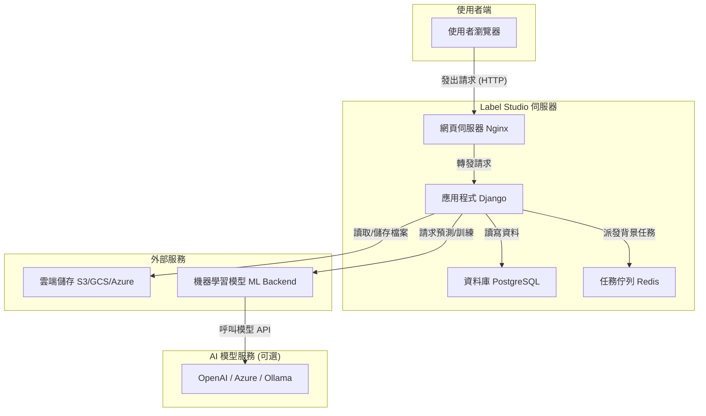

# Label Studio 專案說明

這份文件旨在用簡單易懂的方式，說明 Label Studio 專案。

---

### 1. 本專案用途是什麼? 核心功能是什麼? 實際應用場景是什麼?

#### 專案用途與核心功能
想像一下，你要教一位完全不認識動物的機器人學會分辨「貓」和「狗」。你會怎麼做？你可能會拿很多貓和狗的照片給它看，然後指著照片告訴它：「這是貓」、「這是狗」。

**Label Studio** 就是一個讓你做這件事的「超級工具箱」。它的核心功能是**「資料標註」(Data Labeling)**。簡單來說，就是幫你的原始資料（例如圖片、文章、聲音）做上「標籤」或「註解」，把這些資料變成 AI 或機器學習模型可以學習的「教材」。

#### 實際應用場景
這個工具可以用在各種有趣的地方：
- **自駕車：** 用它來框選出馬路上的行人、汽車、紅綠燈，訓練自駕車「看懂」路況。
- **醫療影像：** 醫生可以用它來圈出 X 光片或 CT 掃描中的腫瘤，訓練 AI 輔助診斷。
- **聊天機器人：** 標註使用者和客服的對話，讓機器人學會如何更聰明、更人性化地回答問題。
- **社群媒體：** 標註貼文內容是否包含不當言論，訓練 AI 自動審核內容。

總之，只要你想訓練一個 AI 模型來「辨識」或「分類」某些東西，Label Studio 就能幫你準備它需要的「課本」。

---

### 2. 本專案的 Input/Output 分別是什麼?

#### 輸入 (Input)
專案的輸入是你想要讓 AI 學習的「**未經處理的原始資料**」。就像是還沒畫重點的課本一樣。這些資料可以是：
- **圖片：** .jpg, .png, .gif 等，例如一堆貓和狗的照片。
- **文字：** .txt, .csv, .html 等，例如電影評論、客服對話紀錄。
- **聲音：** .wav, .mp3, .flac 等，例如鳥叫聲的錄音。
- **影片：** .mp4, .webm 等，例如一段行車記錄器的影像。

你把這些資料「匯入」到 Label Studio 中，建立一個個等待處理的「任務」。

#### 輸出 (Output)
專案的輸出是「**已經標註好的資料**」，也就是 AI 的「**精讀教材**」。這些標註好的資料會包含原始資料，以及你加上去的標籤。

舉例說明：
- **輸入：** 一張貓的照片 `cat.jpg`。
- **你在 Label Studio 做的操作：** 用方框工具把貓框起來，並給它一個標籤 `cat`。
- **輸出：** 一個 JSON 或 CSV 檔案，裡面記錄著：
  - 檔案名稱：`cat.jpg`
  - 標籤：`cat`
  - 座標：`[x: 50, y: 60, width: 100, height: 120]` (貓在圖片中的位置)

這個輸出檔案就可以直接拿去餵給 AI 模型，讓它學習「哦，原來長這樣、在這個位置的東西，就叫做『貓』」。輸出的格式很多樣，例如 COCO、YOLO 等，都是不同 AI 框架喜歡的「食譜」。

---

### 3. 本專案用到那些 LLM?

本專案深度整合了**大型語言模型 (Large Language Models, LLM)**，讓標註工作變得更輕鬆、更快速。它主要透過 API 連接外部的 LLM 服務，而不是自己本身是一個 LLM。

#### 使用的 LLM 服務
- **OpenAI:** 可以連接到 OpenAI 的各種模型，例如 GPT-4, GPT-4o 等。這是最主要的整合服務之一。
- **Azure OpenAI:** 如果你是使用微軟的 Azure 雲端服務，也可以連接到上面部署的 OpenAI 模型。
- **相容 OpenAI 的模型:** 專案也支援其他 API 格式與 OpenAI 相容的 LLM 服務，例如開源的 **Ollama**（可以讓你跑像 Llama 3 這樣的模型）等。

#### LLM 用在哪裡?
LLM 主要應用在「**AI 輔助標註**」上，像是你的智慧小幫手：
1. **互動式標註：** 在一個類似 ChatGPT 的聊天介面中，你可以對資料下指令。例如，給它一篇文章，然後問「這篇文章的情緒是正面還是負面？」，LLM 會給你答案，你只需要確認或微調即可。
2. **自動預標註 (Pre-labeling)：** 在你開始手動標註前，先讓 LLM 跑一遍所有資料，自動幫你把可能的標籤都打好。例如，它會自動把所有圖片中的人、車都框出來，你只需要檢查和修正錯誤的部分，大大節省時間。
3. **產生資料：** 甚至可以讓 LLM 幫你產生用於標註的內容，例如，產生各種風格的句子讓你來分類。

舉例來說，在標註介面的設定中，你可以直接指定一個 LLM 模型，如 `<Chat llm="openai/gpt-4o-mini" />`，這樣這個聊天視窗就會由 gpt-4o-mini 模型來驅動。

---

### 4. 調整配置參數會有哪些影響?

你可以透過設定「**環境變數**」(Environment Variables) 來調整專案的行為，就像是遊戲裡的設定選項。這些設定通常在專案啟動前就要設定好。以下是一些重要的參數：

| 參數名稱 | 說明 | 影響 |
| :--- | :--- | :--- |
| `DEBUG` | **除錯模式** (預設: `True`) | 設為 `True` (開啟) 時，如果程式出錯，會顯示詳細的錯誤報告，方便開發者修理。在正式環境中應該關閉 (`False`) 以策安全。 |
| `DATABASE_NAME`<br>`POSTGRE_HOST` | **資料庫設定** | 決定專案的所有資料（使用者、專案、標籤成果）要儲存在哪裡。就像是選擇你的遊戲存檔要放在哪個資料夾。 |
| `OPENAI_API_KEY` | **OpenAI API 金鑰** | 如果你想使用 OpenAI 的模型來輔助標註，就必須填入你的個人金鑰，程式才知道你有權限使用這個服務。 |
| `DISABLE_SIGNUP_WITHOUT_LINK` | **關閉自由註冊** (預設: `False`) | 設為 `True` 時，使用者就不能自己註冊帳號，只能透過管理員發送的邀請連結來註冊。適合團隊內部使用，避免陌生人亂入。 |
| `ENABLE_LOCAL_FILES_STORAGE` | **允許存取本機檔案** (預設: `True`) | 決定 Label Studio 能不能讀取伺服器本機的檔案。如果關閉，就只能讀取像 AWS S3 這類的雲端儲存。 |

---

### 5. 請提供完整執行過程步驟與系統架構

#### 完整執行步驟 (使用 Docker)
最簡單的執行方式是透過 Docker，它能幫你把所有需要的環境都打包好。
1. **取得專案：** 從 GitHub 下載專案程式碼。
    ```bash
    git clone https://github.com/HumanSignal/label-studio.git
    cd label-studio
    ```
2. **啟動專案：** 在專案根目錄下，執行以下指令。Docker 會自動下載所有需要的東西並啟動服務。
    ```bash
    docker-compose up
    ```
3. **開始使用：** 打開你的網頁瀏覽器，輸入 `http://localhost:8080`，你就會看到 Label Studio 的畫面。註冊第一個帳號，它會自動成為管理員，然後你就可以開始建立專案、匯入資料和標註了！

#### 系統架構 (Mermaid 格式)
這張圖簡單說明了 Label Studio 的系統架構：


**架構解說：**
1. **使用者**透過**瀏覽器**操作介面 (React 寫的)。
2. 請求會先經過 **Nginx** (網頁伺服器)，再送到核心的 **Django** 應用程式。
3. **Django** 負責所有商業邏輯，並將使用者、專案設定等資訊存入 **PostgreSQL** 資料庫。
4. 對於耗時的任務（如資料匯入/匯出），會丟到 **Redis** 任務佇列中背景執行。
5. 資料檔案可以儲存在**雲端儲存**服務上。
6. 當需要 AI 輔助標註時，Django 會透過 **ML Backend** (機器學習後端) 去呼叫 **OpenAI** 等外部模型服務。

---

### 6. 本專案在公司內部有哪些應用方向？

- **優化內部搜尋引擎：** 標註搜尋結果與使用者查詢的相關性，訓練模型提供更精準的搜尋結果。
- **智能客服系統：** 標註客戶問題的意圖、情緒和關鍵資訊，訓練更懂客戶的自動回覆機器人。
- **合約文件分析：** 標註合約中的關鍵條款（如金額、日期、簽約方），開發自動審核合約的工具。
- **品管瑕疵檢測：** 在產線上拍攝產品照片，標註出瑕疵（刮痕、汙點），訓練 AI 進行自動化品管。

---

### 7. 如果要自行新增一個案例，建議新增哪個案例？

建議新增「**音樂風格分類與標註**」的案例。

**為什麼？**
- **趣味性高：** 對大多數人來說，音樂是比工業或醫學更有趣的主題，容易上手。
- **多模態潛力：** 這個案例不只包含聲音，還可以結合文字（歌詞）、數字（節奏 BPM）、圖片（專輯封面）等多種資料類型，能充分展現 Label Studio 的彈性。
- **應用廣泛：** 成果可以應用於音樂推薦系統、播放清單自動生成、版權監控等。

**如何實現？**
1. **輸入資料：**
    - 匯入一批 30 秒的 `.mp3` 音樂片段。
    - 搭配一個 CSV 檔，包含每首歌的歌名、歌手和歌詞。
2. **標註介面設計：**
    - 使用 `<Audio>` 標籤來播放音樂。
    - 使用 `<Choices>` 標籤讓使用者選擇音樂風格（如：搖滾、古典、爵士、電子）。
    - 使用 `<Rating>` 標籤讓使用者評分這首歌的「活力值」(1-5分)。
    - 使用 `<TextArea>` 顯示歌詞，並讓使用者標註歌詞中的情緒轉折點。
3. **最終目標：** 訓練一個 AI 模型，只要給它一首新歌，它就能自動判斷這首歌的風格、活力值，並分析歌詞情緒。

---

### 8. 針對專案有哪些需要補充說明的部分？

- **開源且免費：** Label Studio 的社群版是完全開源且免費的，任何人都可以下載使用和修改，擁有非常活躍的社群。
- **高度客製化：** 它的標註介面是使用類似 HTML 的標籤語言來定義的，非常靈活，你可以組合出幾乎任何你想要的標註場景，而不是被限制在固定的幾種工具上。
- **不只是標註：** 它也逐漸整合了資料管理和模型評估的功能，讓它成為一個更全面的 AI 資料開發平台。

---
